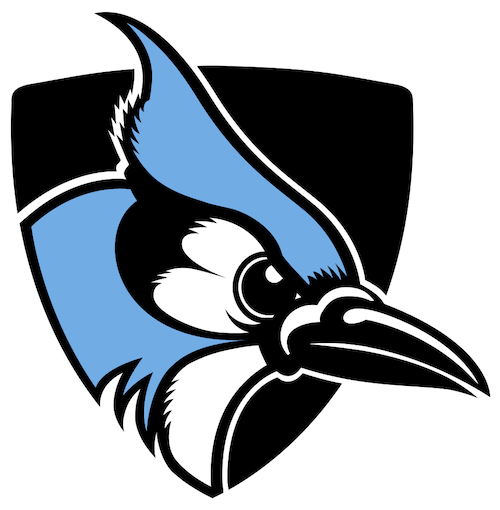
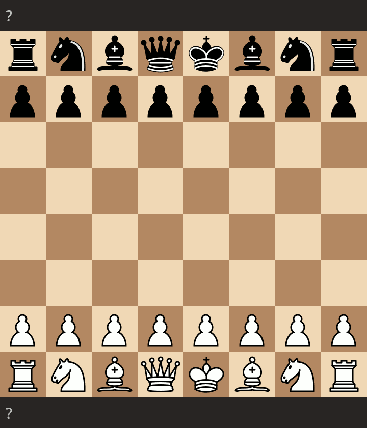

# BertHarmon

Research done at Johns Hopkins University by Michael DeLeo

Contact: mdeleo2@jh.edu

## Links

[Github](https://github.com/deleomike/NLP-Chess)

[HuggingFace](https://huggingface.co/squish/BertHarmon)

## Introduction

BertHarmon is a BERT model trained for the task of Chess.



## Sample Usage

```python
from transformers import pipeline
task = pipeline('fill-mask', model='BertHarmon')
task("rnbqkbnr/pppppppp/8/8/8/8/PPPPPPPP/RNBQKBNR w KQkq - 0 1 White <MOVE_SEP> [MASK]")
```

The base string consists of the FEN_position followed by the player color and a move seperator. Finally with the [MASK] token. The mask token is the algebraic notation for a chess move to be taken givent the current board state in FEN Notation

# BERT-Harmon Training

## Setup

1. Make sure docker and docker compose are installed.
2. For a GPU enabled machine, install nvidia runtime
   1. LINUX: ```sudo apt-get install nvidia-docker2 -y```
   2. Windows: TODO

## Training

### Build Locally

CPU Machine
```commandline
docker compose up --build
```

OR

GPU Machine

```commandline
docker compose up --build -f docker-compose-gpu.yml
```

### Use the remote image

```commandline
docker compose up -f docker-compose-remote.yml
```

### Running

Then open the local jupyter lab server at: http://127.0.0.1:8080

The main notebook for training BERT is /src/bert/train_bert.ipynb

[Resource](https://www.datalearnings.com/how-to-run-tensorflow-using-nvidia-cuda-and-docker-on-windows-wsl/) for running docker with GPU support on windows


